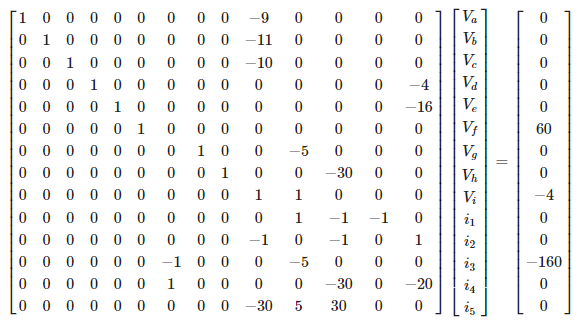

# Resolução da Questão 4 do Trabalho Avaliativo de Análise de Circuitos

O circuito representado pela figura:

<div align="center">

</div>

Pode ser modelado pelas leis de Ohm, Kirchoff da Corrente nos Nós e Kirchoff da Tensão nas Malhas para o seguinte sistema linear:

<div align="center">

</div>

Sua representação matricial é dada por:

<div align="center">

</div>

E usaremos a biblioteca numpy para resolvê-lo. Primeiro, devemos importar a biblioteca.

## Importando o Numpy

```python
import numpy as np
import pandas as pd
```

## Definindo a matriz A de coeficientes

```python
A = np.array([
    [1] + [0 for i in range(8)] + [-9] + [0 for i in range(4)],
    [0, 1] + [0 for i in range(7)] + [-11] + [0 for i in range(4)],
    [0, 0, 1] + [0 for i in range(6)] + [-10] + [0 for i in range(4)],
    [0 for i in range(3)] + [1] + [0 for i in range(9)] + [-4],
    [0 for i in range(4)] + [1] + [0 for i in range(8)] + [-16],
    [0 for i in range(5)] + [1] + [0 for i in range(8)],
    [0 for i in range(7)] + [1, 0, 0, -4] + [0 for i in range(3)],
    [0 for i in range(8)] + [1, 0, 0, -30, 0, 0],
    [0 for i in range(9)] + [1, 1, 0, 0, 0],
    [0 for i in range(10)] + [1, -1, -1, 0],
    [0 for i in range(9)] + [-1, 0, -1, 0, 1],
    [0 for i in range(6)] + [-1, 0, 0, 0, -5, 0, 0, 0],
    [0 for i in range(6)] + [1, 0, 0, 0, 0, -30, 0, -20],
    [0 for i in range(9)] + [-30, 5, 30, 0, 0]
])

B = np.array(
    [[0] for i in range(5)] + [[60], [0], [0], [-4], [0], [0], [-160], [0], [0]]
)
```

## Definindo a matriz B de termos independentes

```python
B = np.array(
    [[0] for i in range(5)] + [[60], [0], [0], [-4], [0], [0], [-160], [0], [0]]
)
```

## Definindo o nome das variáveis

```python
nomes_variaveis = ['V_a', 'V_b', 'V_c', 'V_d', 'V_e', 'V_f', 'V_g', 'V_h', 'V_i', 'i_1', 'i_2', 'i_3', 'i_4', 'i_5']
```

## Calculando os resultados

```python
resultados = np.linalg.solve(A, B).ravel()
```

## Mostrando os resultados com formatação em latex:

```python
from IPython.display import display, Markdown, Latex

unidade = {}
# 1. Definindo as unidades das variáveis de tensão como Volt
for nome_variavel in nomes_variaveis[0:9]:
    unidade[nome_variavel] = 'V'
    
# 2. Definindo as unidades das variáveis de corrente como Ampére
for nome_variavel in nomes_variaveis[9:14]:
    unidade[nome_variavel] = 'A'
    
# criando string para armazenar o resultado em formato latex

resultado_tex = '''$$
\\begin{align}
'''

# adicionando cada resultado em resultado_tex em formato latex

for nome_variavel, resultado in zip(nomes_variaveis, resultados):
    resultado_tex += '    &{} = {:.2f}{}\\\\\n'.format(nome_variavel, resultado, unidade[nome_variavel])

# finalizando a string

resultado_tex += '''\end{align}
$$
'''
display(Markdown(resultado_tex))
```

<div align="center">

</div>
